# Lesson 02: User Interaction In Web Maps

## Overview

In Module 09 of MAP672, we used an AJAX request to dynamically request a GeoJSON data file and load it into the script after the DOM had loaded. We then wrote functions to normalize and classify the data on the fly, appropriately color a choropleth map, and dynamically create a legend depicting the class ranges.

Within this lesson, we extend this code to include a **user interface (UI)** element that allows the user to select a new data attribute that dynamically updates the map and legend.

## Table of Contents

<!-- TOC -->

- [Lesson 02: User Interaction In Web Maps](#lesson-02-user-interaction-in-web-maps)
    - [Overview](#overview)
    - [Table of Contents](#table-of-contents)
    - [User Interaction](#user-interaction)
    - [Structuring functions within JavaScript](#structuring-functions-within-javascript)
    - [Dynamically drawing a map and legend](#dynamically-drawing-a-map-and-legend)
        - [Drawing the map](#drawing-the-map)
        - [Updating the map with attributes](#updating-the-map-with-attributes)
        - [Drawing the legend](#drawing-the-legend)
    - [Building a user interface for updating the map](#building-a-user-interface-for-updating-the-map)
        - [Adding and positioning the dropdown menu to the map](#adding-and-positioning-the-dropdown-menu-to-the-map)
            - [Structuring a UI form element in HTML](#structuring-a-ui-form-element-in-html)
            - [Using the Leaflet L.Control class to add UI elements to the map](#using-the-leaflet-lcontrol-class-to-add-ui-elements-to-the-map)
    - [Adding functional interaction to the interface](#adding-functional-interaction-to-the-interface)
        - [Applying the user-selected value to the map](#applying-the-user-selected-value-to-the-map)
    - [Lesson Task](#lesson-task)
        - [Deliverable](#deliverable)
    - [Resources](#resources)

<!-- /TOC -->

## User Interaction

Begin this lesson by reading and reflecting upon Frank Chimero's [Chapter Two: Craft and Beauty](http://shapeofdesignbook.com/chapters/02-craft-and-beauty/). Take some notes of what strikes you as you read. 

> Hand axes are frequently cited as the first human-made objects; the oldest specimens, discovered in Ethiopia, are estimated to be about two-and-a-half million years old. We have been molding this world for a very long time. <span style="float:right; margin-top: 1em;">&ndash; Frank Chimero, _The Shape of Design_</span><br style="clear:right">

Within this lesson, we take some bold steps toward "improving" a static web map by adding the potential for the user to update it dynamically. The square quotes around "improving" are made with Chimero's assertion in mind. While new, shiny tools like web maps excite us, we should remember that what appears new and shiny may not be as new as we think. It's essential to allow innovation to inspire our work while being mindful of what is enduring and continuous. That being stated, we begin.

Open the _index.html_ file found in the _lesson-02/_ directory in your code editor to edit this file as you progress through the lesson. Launch the file within your browser using a local server. You should see the following template built using Bootstrap. It loads a tiled base map from CARTO and centers the map roughly on North America with the `center` and `zoom` properties of Leaflet's `L.map()` constructor.

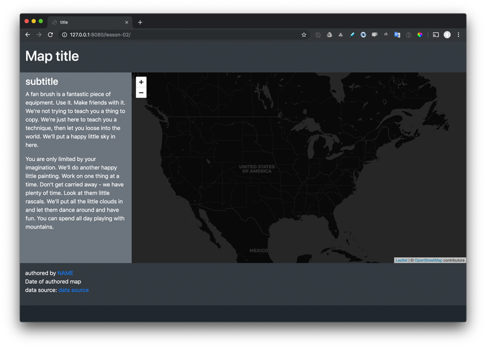  
*Starter HTML document for Lesson 02 rendered in the browser.*

Take some time to read through the starter file's CSS, HTML, and JavaScript (and comments).

Within the `<head></head>` tags of the document, you'll see that the Leaflet and Bootstrap CSS are requested from remote sources.

```html
<head>
    <meta charset="utf-8">
    <meta name="viewport" content="width=device-width, initial-scale=1, shrink-to-fit=no">
    <title>title</title>
    <!-- Bootstrap CSS -->
    <link rel="stylesheet" href="https://cdn.jsdelivr.net/npm/bootstrap@4.5.3/dist/css/bootstrap.min.css" integrity="sha384-TX8t27EcRE3e/ihU7zmQxVncDAy5uIKz4rEkgIXeMed4M0jlfIDPvg6uqKI2xXr2" crossorigin="anonymous">
    <!-- Leaflet CSS -->
    <link rel="stylesheet" href="https://unpkg.com/leaflet@1.7.1/dist/leaflet.css" integrity="sha512-xodZBNTC5n17Xt2atTPuE1HxjVMSvLVW9ocqUKLsCC5CXdbqCmblAshOMAS6/keqq/sMZMZ19scR4PsZChSR7A==" crossorigin=""/>
    <!-- Fonts -->
    <link href="https://fonts.googleapis.com/css2?family=Open+Sans:ital,wght@0,400;0,800;1,800&display=swap" rel="stylesheet">
    <style>
        body {
            background: #20282e;
            font-family: 'Open Sans', sans-serif;
            font-weight: 400;
        }

        h1 {
            font-weight: 800;
        }

        p {
            line-height: 1.7rem;
        }

        #map {
            height: 80vh;
            background: #20282e;
        }

    #legend {
            font-size: 1rem;
            border-radius: 5px;
            max-width: 200px;
            font-family: 'Open Sans', sans-serif;
        }

        #legend span {
            width: 20px;
            height: 20px;
            float: left;
            margin: 0 10px 4px 0;
        }

        #legend label {
            font-size: 0.9rem;
        }

        #legend label:after {
            content: '';
            display: block;
            clear: both;
        }

        /* Small devices (landscape phones, 576px and up) */
        @media (min-width: 576px) {}

        /* Medium devices (tablets, 768px and up) */
        @media (min-width: 768px) {

            aside {
                height: 80vh;
            }
        }

        /* Large devices (desktops, 992px and up) */
        @media (min-width: 992px) {}

        /* Extra large devices (large desktops, 1200px and up) */
        @media (min-width: 1200px) {}
    </style>

</head>
```

There are also some minimal custom CSS rules applied to the `body` and `<div>` element with an id of `#map` and `#legend`, as well as some CSS for applying rules conditionally based on responsive breakpoints.

The body of the document contains the structured HTML, which also contains numerous Bootstrap CSS classes that define the layout and style of the HTML elements.

```html
<body>

    <div class="container-fluid">
        <header class="row bg-dark text-white py-3">
            <div class="col">
                <h1>Map title</h1>
            </div>
        </header>

        <section class="row">
            <div class="col-md-8 col-lg-9 col-xl-10 order-md-2 px-0">
                <div id="map"></div>
            </div>
            <aside id="about" class="col-md-4 col-lg-3 col-xl-2 order-md-1 text-white py-2 pl-3 bg-secondary overflow-auto">
                <section>
                    <h3 class="py-2">subtitle</h3>
                    <p>A fan brush is a fantastic piece of equipment. Use it. Make friends with it. We're not trying to teach you
                        a thing to copy. We're just here to teach you a technique, then let you loose into the world. We'll put a
                        happy little sky in here.</p>
                    <p>You are only limited by your imagination. We'll do another happy little painting. Work on one thing at a
                        time. Don't get carried away - we have plenty of time. Look at them little rascals. We'll put all the little
                        clouds in and let them dance around and have fun. You can spend all day playing with mountains.</p>
                </section>
            </aside>
        </section>

        <footer class="row bg-dark text-white py-3">
            <div class="col">
                <ul class="list-unstyled">
                    <li>authored by <a href="#">NAME</a></li>
                    <li>Date of authored map</li>
                    <li>data source: <a href="#">data source</a></li>
                </ul>
            </div>
        </footer>
    </div>

    <!-- legend is outside of container-fluid and will be dynamically added to map -->
    <!-- <div class="bg-secondary py-2 px-3 ml-3 mt-3 text-white" id="legend"></div> -->

    <!-- ui is outside of container-fluid and will be dynamically added to map -->
    <!-- <div class="form-group mr-3 mt-3" id="dropdown-ui">
        <select class="form-control bg-primary text-white">
            <option value="OWNED_MORT" selected>owned with mortgage</option>
            <option value="OWNED_FREE">owned free and clear</option>
            <option value="RENTER">rented</option>
        </select>
  </div> -->
```

You can see that there are some additional elements commented out toward the bottom of this code snippet. Those are written outside of the `<div class="container-fluid"></div>` tags, which contain all the visible elements of the web application. We'll be un-commenting those elements later and using the JavaScript to add them to the map dynamically.

Finally, toward the bottom of the document's body, we request some JavaScript libraries from remote sources and then write our custom JavaScript code within the `<script></script>` tags. 


```html
<!-- jQuery first and the minified version from jQuery site, not the slim minified version from Bootstrap's site. -->
<script src="https://code.jquery.com/jquery-3.5.1.min.js" integrity="sha256-9/aliU8dGd2tb6OSsuzixeV4y/faTqgFtohetphbbj0=" crossorigin="anonymous"></script>
<!-- then Popper JS -->
<script src="https://cdn.jsdelivr.net/npm/popper.js@1.16.1/dist/umd/popper.min.js" integrity="sha384-9/reFTGAW83EW2RDu2S0VKaIzap3H66lZH81PoYlFhbGU+6BZp6G7niu735Sk7lN" crossorigin="anonymous"></script>
<!-- then Bootstrap JS -->
<script src="https://cdn.jsdelivr.net/npm/bootstrap@4.5.3/dist/js/bootstrap.min.js" integrity="sha384-w1Q4orYjBQndcko6MimVbzY0tgp4pWB4lZ7lr30WKz0vr/aWKhXdBNmNb5D92v7s" crossorigin="anonymous"></script>
<!-- then Leaflet JS -->
<script src="https://unpkg.com/leaflet@1.7.1/dist/leaflet.js" integrity="sha512-XQoYMqMTK8LvdxXYG3nZ448hOEQiglfqkJs1NOQV44cWnUrBc8PkAOcXy20w0vlaXaVUearIOBhiXZ5V3ynxwA==" crossorigin=""></script>
<!-- then Simple Statistics -->
<script src='https://unpkg.com/simple-statistics@7.3.0/dist/simple-statistics.min.js'></script>
<!-- finally your JS below... -->
```

A basic Leaflet map is created and, since we're using jQuery with Bootstrap, a request for the GeoJSON data is made using a jQuery AJAX request.

```javascript
// initial Leaflet map options
const options = {
    zoomSnap: .1,
    center: [40, -90],
    zoom: 4
}

// create Leaflet map and apply options
const map = L.map('map', options);

// request a basemap tile layer and add to the map
L.tileLayer('https://{s}.basemaps.cartocdn.com/dark_all/{z}/{x}/{y}{r}.png', {
    attribution: '&copy; <a href="https://www.openstreetmap.org/copyright">OpenStreetMap</a> contributors'
}).addTo(map);

$.getJSON("data/ky_counties_housing.json", function (data) {
    // jQuery method uses AJAX request for the GeoJSON data
    console.log(data)
});
```

When you open your web developer toolbar and examine the output in the Console tab, you should see the GeoJSON structure.

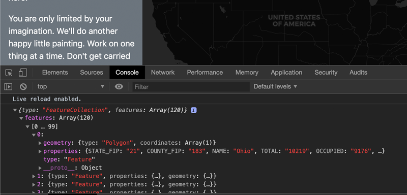  
*GeoJSON loaded into the script and logged to Console.*

In this lesson, continue to improve the design and the development of the starter template to:

1. load the data ('data/ky_counties_housing.json') into the script
2. draw the GeoJSON data to the Leaflet web map
3. apply an appropriate thematic color scheme to the map using an initial data property attribute
4. create a legend indicating the classification range values and associated colors
5. give the user the ability to switch between various data attributes within the _kentucky_counties_housing.json_ data file using a dropdown UI element. The map will dynamically update to reflect these changes by updating the values of the `attributeValue` and `normValue` variables within the script.

The resultant map will look and behave something like this:

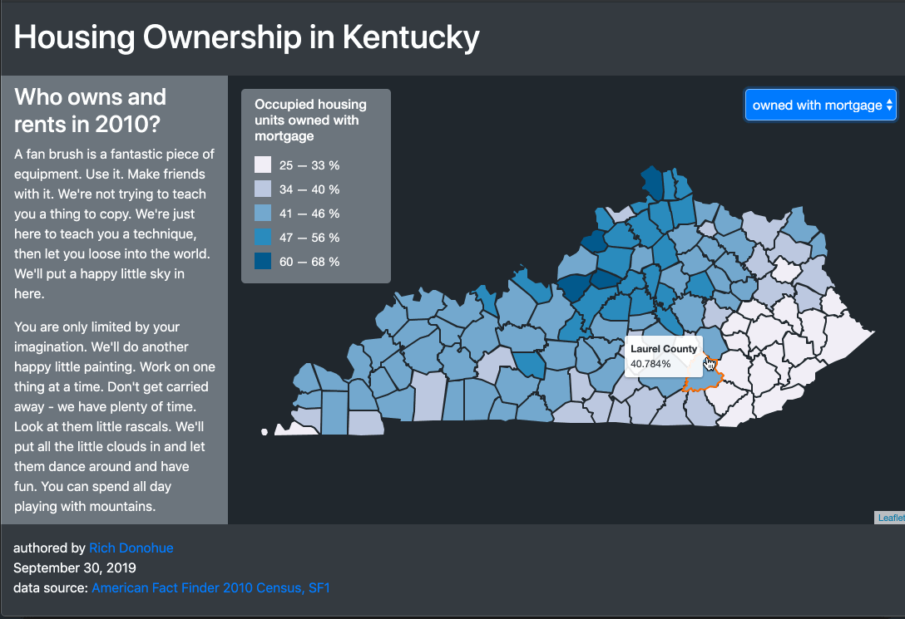  
*The final map of the lesson.*

Notice that not only does map update, the legend also displays the updated legend title and the re-calculated classification breaks for the data distribution.

User interaction is one of the most important differences between traditional static maps and maps we now make for and use on the web. The ability to change the map not only offers new possibilities for understanding the information. It also empowers the users and makes engaging with the map more fun and interesting.

Before we get to drawing the map and adding interaction, let's take some time to understand better how the script is structured and runs using the various functions. This 'chain of functions' is a challenging aspect for previous New Maps Plus students at this juncture, so read carefully and contact your instructor for further clarification if the flow of the program's execution is still puzzling.

## Structuring functions within JavaScript

We'll be writing several functions within this module. As newbie coders, we may often be confused about where we should write these functions within the overall script.

The answer isn't straightforward, but as far as the browser is concerned, it doesn't matter when it comes to JavaScript. Because of function "hoisting," they are ready and waiting to be called where ever we write them.

One thing to be mindful of, however, is where a function body beings and ends, and not unintentionally to write one function within another.

It's common to write functions vertically (down) through the coded script in the order in which they are called. The starter template has provided the (empty) functions for this lesson for you. Here I've included some comments explaining what each function will do.

```javascript
function drawMap() {
   // function is called one time, once the data is properly loaded.
   // creates a new L.geoJson object and adds it to map, including basic
   // options for the map as well as some interactive mouseover style
   // changes.
   // function then calls other functions to add the legend, update the map's
   // thematic encoding (color), and add the UI dropdown element
}

function updateMap() {
   // function is called initially on the page load and then
   // once every time the user updates the map by selecting a new
   // dropdown option. function accepts the L.geoJson LayerGroup object
   // as a parameter, loops through all the layers, updates the fillColor
   // option property based on the calculated (normalized) value, and updates the
   // tooltip with current information.
   // function also calls the updateLegend function to update with the new
   // classification breaks
}

function getClassBreaks() {
   // function accepts the Leaflet L.GeoJson LayerGroup
   // as a parameter and loops through the feature properties
   // to derive a set of classification breaks based upon the current
   // selected attribute. function returns these breaks as an array
}

function getColor() {
   // function accepts a single normalized data attribute value
   // and an array of breaks as two parameters and 
   // uses a series of conditional statements to determine which
   // which color value to return to return to the function caller
}

function addLegend() {
   // function is called once, selects a DOM element to hold the 
   // map legend, and adds it as a Leaflet control element
   // create a new Leaflet control object, and position it top left
}

function updateLegend() {
   // function accepts an array of classification breaks values as
   // a parameter and draws/updates the legend based upon these values
   // select the legend, add a title, begin an unordered list and assign to a variable
}

function addUi() {
   // function selects a DOM element for the UI dropdown,
   // adds it to the map as a Leaflet control object
   // and listens for changes to the dropdown, calling the
   // updateMap function when the user selects a new value
   // create the slider control
}
```

These functions are "empty" now. You'll need to add code within them, as well as write parameters within the function signature (i.e., within the parentheses).

We can declare these functions in any order within the script; it's often best in these more straightforward applications to write the functions within the script from top to bottom to follow the flow of the execution of the program.

Within this module **we will not be writing functions within other functions**. However, we will be calling our functions, as well as Leaflet and JQuery methods, from within the function bodies. This sequence of calls is how we control the flow of the script. Functions are not all called at once, but rather at an appropriate time. For example, we only want to call a function to update the map when the user has changed the UI.

What does matter is the order in which the functions are invoked or called when the script runs. We will also be passing data as arguments from one function to another function so that function calls *inside* other functions can have access to the data.

It's helpful to think through the program's "flow of execution." Begin when the page loads. What is the first line of JavaScript to execute? When a statement calls a function, jump down to that function (in your mind) and think through the code within the function body. Does it return a value? Follow the flow of execution back to where the function was called if it does. If the function calls another function, jump to that function and continue to follow the execution of JS statements.

It's essential to cultivate the ability to follow the execution of the code in your mind, rather than simply scanning statements and functions for syntax errors and applying `console.log()` statements is also useful for determining the order in which certain statements in your script are executed.

As always, keep your indentations clean within your script and be consistent (4 spaces, one 2-space tab, one 4-space tab, etc.). It is recommended that you format your document periodically to understand better the syntax, e,g., in VS Code you can right-click the document anywhere and **Format document**. You can also use plugins/extensions like [Prettier](https://prettier.io/).

## Dynamically drawing a map and legend

We'll begin by revisiting the process covered in MAP672 for creating a choropleth map in Leaflet. We'll move through this section fairly quickly.

As we see within the starter template, we're successfully requesting the data file and it is accessible within the callback function of the jQuery `.getJSON()` method:

```javascript
$.getJSON("data/ky_counties_housing.json", function (data) {
  // jQuery method uses AJAX request for the GeoJSON data
  console.log(data);
});
```

The parameter `data` there references our GeoJSON textual data. If you moved the statement `console.log(data);` outside of that callback function, the Console would output `undefined`. Why?

The parameter `data` is "scoped" to that function body. And the statement `console.log(data);` won't execute until the data is successfully requested and returned to the script. This is how we begin to control the flow of the code's execution.

### Drawing the map

It's good practice to send the data out of the control mechanisms that request the data. So, instead of logging `data` to console, we can call another function and send `data` as an argument. Do this now:

```javascript
$.getJSON("data/ky_counties_housing.json", function (data) {
   // jQuery method uses AJAX request for the GeoJSON data

   // call draw map and send data as paramter
   drawMap(data);
});
```

If we call a function, that function must exist. The starter template provides such a function. However, our statement above calling the function sends `data` as an argument. The `drawMap()` function definition must account for this argument by including an associated parameter. We could name this parameter something else, but for consistency, we may as well use `data.` Update your `drawMap()` function by including a parameter. You can now test and see that data is accessible within the function scope of `drawMap()`

```javascript
function drawMap(data) {
  console.log(data); // data is now accessible here
}
```

Next, we use Leaflet's L.geoJson() method to convert our GeoJSON data into a Leaflet object ready to be added to the map. Replace the `console.log()` statement with the following:

```javascript
const counties = L.geoJson(data).addTo(map);
```

Saving this change within the code and refreshing the browser should plot our data onto the base map:

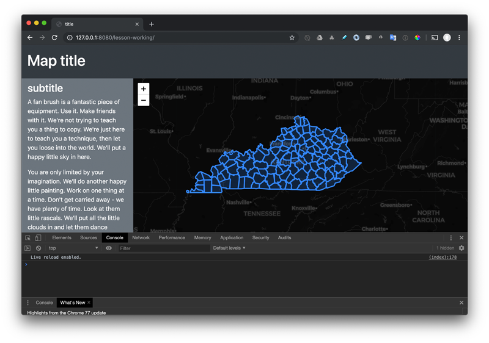  
*Un-styled GeoJSON converted to Leaflet layers and plotted.*

Next, we want to use some of L.geoJson()'s options to modify the path styles and add some basic user interaction. Refer to the documentation: https://leafletjs.com/reference.html#geojson.

Modify you code by including the `style` and `onEachFeature` option functions:

```javascript
// create Leaflet data layer and add to map
const counties = L.geoJson(data, {
  // style counties with initial default path options
  style: function (feature) {
    return {
      color: '#20282e',
      weight: 2,
      fillOpacity: 1,
      fillColor: '#1f78b4'
    };
  },
  // add hover/touch functionality to each feature layer
  onEachFeature: function (feature, layer) {

    // when mousing over a layer
    layer.on('mouseover', function () {

      // change the stroke color and bring that element to the front
      layer.setStyle({
        color: '#ff6e00'
      }).bringToFront();
    });

    // on mousing off layer
    layer.on('mouseout', function () {

      // reset the layer style to its original stroke color
      layer.setStyle({
        color: '#20282e'
      });
    });
  }
}).addTo(map);
```

Code that only needs to run once upon the L.geoJson() layer is now referenced with the variable `counties`. We apply some basic styles to all layers and add some mouseover interaction to provide a visual affordance for the user (to help reinforce which layer/county they are targeting).

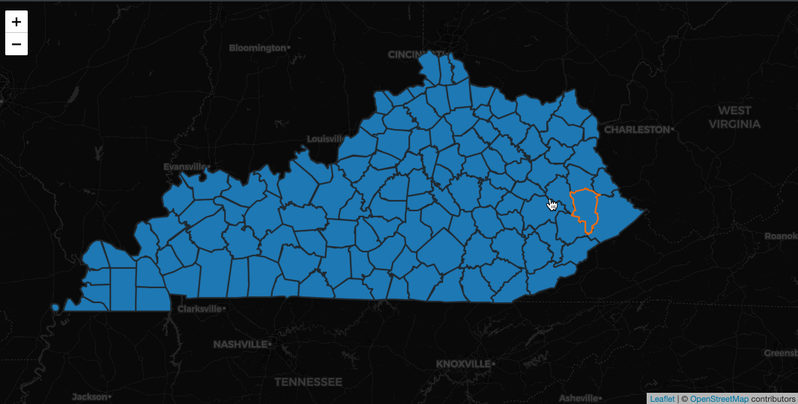  
*Visual affordance added to county polygons.*

We can additionally reset the zoom and center of the map to fit our plotted data nicely.

```javascript
// fit the map's bounds and zoom level using the counties extent
map.fitBounds(counties.getBounds(), {
  padding: [18, 18] // add padding around counties
});
```

When we apply this code, we no longer need the `center` and `zoom` options of the initial map options. Comment out those options to prevent the map from recentering when the page loads.

In the MAP 672 assignment, the `drawMap()` function called the functions `getClassBreaks()` and `addLegend()` (which called the `getColor()` function). Let's add two functions to our `index.html`. Use the code below to update your script.

```js
// Get class breaks in data 
function getClassBreaks(counties) {

  // create empty Array for storing values
  const values = [];

  // loop through all the counties
  counties.eachLayer(function (layer) {
    let value = layer.feature.properties[attributeValue] / layer.feature.properties[normValue];
    values.push(value); // push the normalized value for each layer into the Array
  });

  // determine similar clusters
  const clusters = ss.ckmeans(values, 5);

  // create an array of the lowest value within each cluster
  const breaks = clusters.map(function (cluster) {
    return [cluster[0], cluster.pop()];
  });

  //return array of arrays, e.g., [[0.24,0.25], [0.26, 0.37], etc]
  return breaks;
}

// Get color of county
function getColor(d, breaks) {
  // function accepts a single normalized data attribute value
  // and uses a series of conditional statements to determine which
  // which color value to return to return to the function caller

  if (d <= breaks[0][1]) {
    return '#f1eef6';
  } else if (d <= breaks[1][1]) {
    return '#bdc9e1';
  } else if (d <= breaks[2][1]) {
    return '#74a9cf';
  } else if (d <= breaks[3][1]) {
    return '#2b8cbe'
  } else if (d <= breaks[4][1]) {
    return '#045a8d'
  }
}
```


In our dynamic version, we're going to call these functions outside of the `drawMap()` function. If we kept calling this function, it would add a new Leaflet GeoJSON each time. Instead, we want to call this function once to draw features and then create a new function that calls the other functions necessary to change the county polygon colors when the user makes a selection in our UI.

### Updating the map with attributes

Our next step within this script is to write a new function to update the map with the colors based upon a data attribute. In this case, we're making a choropleth map, so we want to normalize data attributes and determine a classification scheme. 

Thinking forward through our UI/UX goals, we know we want this function to fire every time the user updates the map. Therefore we'll write a function named `updateMap()` and call it immediately when the `drawMap()` function is complete.

The starter template provides this function for us.

```javascript
function updateMap() {

}
 ```

 We now want to call the `updateMap()` function from the bottom of the `drawMap()` function:

 ```javascript
updateMap(counties); // draw the map 
```

What's important here is that we pass an argument when we call the `updateMap()` function: our `counties` variable, which references our Leaflet L.geoJson() object (i.e., our county layers).

What's equally important is that when we call a function and pass an argument we need that function to accept the argument as a parameter defined within the function. So update your function definition:

```javascript
function updateMap(counties) {
  // you could log counties to console here to 
  // verify the Leaflet layers object is not accessible
  // and scoped within this function
  console.log(counties);
}
```

After you verify that you can pass data through multiple functions, let's add the other functions to get class breaks and symbol colors, and then use Leaflet's ``eachLayer()` method to change the symbol style and popup content.

```js
function updateMap(counties) {
  // you could log counties to console here to 
  // verify the Leaflet layers object is not accessible
  // and scoped within this function
  console.log(counties);

  // get the class breaks for the current data attribute
  const breaks = getClassBreaks(counties);

  // loop through each county layer to update the color and tooltip info
  counties.eachLayer(function (layer) {

    const props = layer.feature.properties;

    // set the fill color of layer based on its normalized data value
    layer.setStyle({
      fillColor: getColor(props[attributeValue] /
        props[normValue], breaks)
    });

    // assemble string sequence of info for tooltip (end line break with + operator)
    let tooltipInfo = `<b>${props["NAME"]} County</b></br>
            ${((props[attributeValue] / props[normValue]) * 100).toLocaleString()}%`

    // bind a tooltip to layer with county-specific information
    layer.bindTooltip(tooltipInfo, {
      // sticky property so tooltip follows the mouse
      sticky: true
    });

  });

// update the legend with the current data attribute information
// addLegend(breaks);
}
```

Your map should now draw a choropleth map of homeownership rates, without a legend.

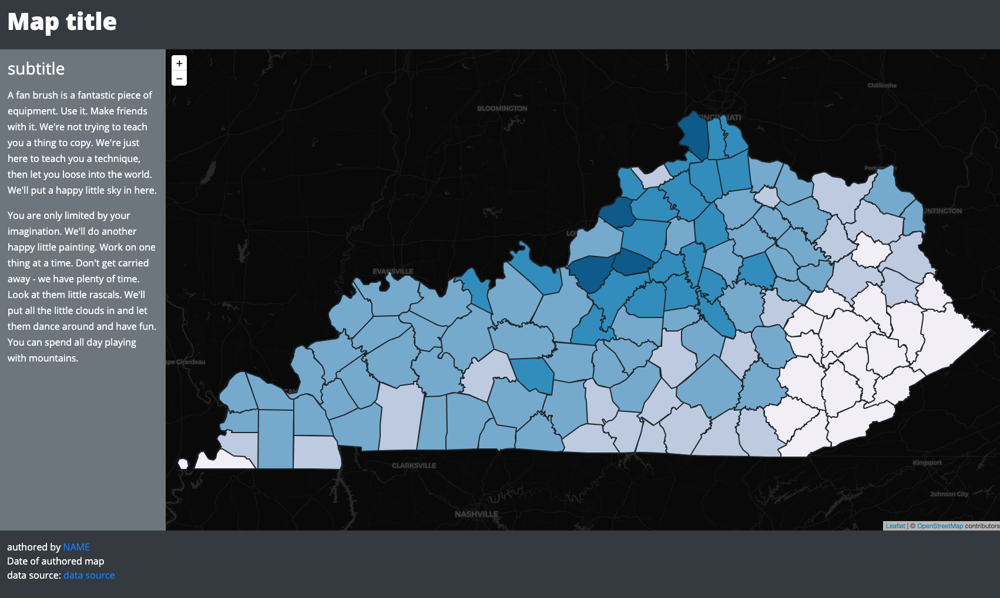    
*Map now drawn with attribute data but without a legend.*

### Drawing the legend


Now that we have the map drawn let's add the legend. In MAP672, we used Leaflet's `L.DomUtil.create()` to make a legend. Because we are using Bootstrap, we can create an element with a custom class that fits into our visual theme. We use Leaflet's `L.DomUtil.get()` to access a `div` with a selected id, make a Leaflet control object, and add the legend content.

```js
// Add legend to map
function addLegend(breaks) {

  // create a new Leaflet control object, and position it top left
  const legendControl = L.control({ position: 'topleft' });

  // when the legend is added to the map
  legendControl.onAdd = function() {

    // select a div element with an id attribute of legend
    const legend = L.DomUtil.get('legend');

    // disable scroll and click/touch on map when on legend
    L.DomEvent.disableScrollPropagation(legend);
    L.DomEvent.disableClickPropagation(legend);

    // return the selection to the method
    return legend;

  };

  // add the empty legend div to the map
  legendControl.addTo(map);

  // select the legend, add a title, begin an unordered list and assign to a variable
  const legend = $('#legend').html(`<h5>${labels[attributeValue]}</h5>`);

  // loop through the Array of classification break values
  for (let i = 0; i <= breaks.length - 1; i++) {

    let color = getColor(breaks[i][0], breaks);

    legend.append(
      `<span style="background:${color}"></span>
      <label>${(breaks[i][0] * 100).toLocaleString()} &mdash;
      ${(breaks[i][1] * 100).toLocaleString()}%</label>`);
  }
}
```

After you add this to your `index.html` you will need to uncomment a few lines to see the legend. First, uncomment the line in HTML that creates the `div` element with the `legend` id. The legend has some Bootstrap classes applied for styling the element.

```html
<!-- legend is outside of container-fluid and will be dynamically added to map -->
<div class="bg-secondary p2 ml-3 mt-3 text-white" id="legend"></div> -->
```

Next, find the the `addLegend()` function call in the `updateMap()` definition.

```js
// update the legend with the current data attribute information
addLegend(breaks);
```

You should now find the legend drawn on your map.

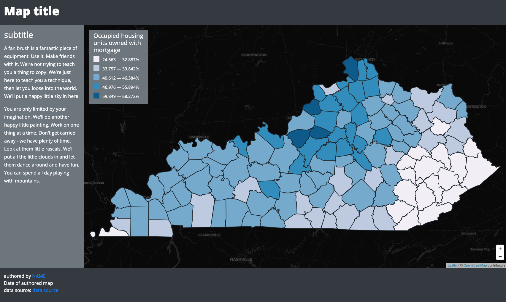    
*Map now drawn with attribute data and a legend.*

Note: if you want to move the zoom control, you should disable the default zoom in the map object options and then create a new control with a different position on the map:

```js
const options = {
            zoomSnap: .1,
            // center: [40, -90], 
            // zoom: 4,
            zoomControl: false
        }
// create Leaflet map and apply options
const map = L.map('map', options);
new L.control.zoom({position:"bottomright"}).addTo(map)
```


## Building a user interface for updating the map

One solution for toggling on and off different data layers on a map would be to draw several Leaflet GeoJSON layers using different data attributes and use the [Leaflet Layer Control](http://leafletjs.com/examples/layers-control/) (introduced in MAP672). This solution is okay, but we want to push ourselves to explore more flexible and customized solutions for interface design.

Rather than use Leaflet's layer control, we're going to make use of HTML forms to enhance the user's interaction with our map. HTML forms are web standards, natively supported in modern browsers (i.e., not requiring additional JavaScript libraries) and used for user interaction. Read more about [HTML forms](https://developer.mozilla.org/en-US/docs/Web/Guide/HTML/Forms) and [HTML form elements](http://www.w3schools.com/html/html_form_elements.asp).

Within this lesson, we'll also be using more of JQuery's functionality to select HTML elements and "listen" for user interaction upon them (i.e., "did the user select an option in this dropdown?").

### Adding and positioning the dropdown menu to the map

We'll begin by first modifying our document to include a form element to our HTML. While either radio buttons or a dropdown list is suitable for this task, we'll go with the dropdown. To do this, we'll use the [`<select>` form element](https://developer.mozilla.org/en-US/docs/Web/HTML/Element/select).

#### Structuring a UI form element in HTML

Let's begin by creating a generic `<div>` wrapper for our user interface controls and give it with an `id` attribute value of `dropdown-ui`.  You can un-comment the code beneath the legend element to start.

Since we can dynamically place this element on or around our map, it doesn't matter so much where we write it within the HTML. To keep the structure of our HTML clean and readable, place it directly below the already-existing legend (but above the `<script>` tags that load the JS files). The element is styled with Bootstrap classes.

```html
<!-- 
  legend is outside of container-fluid and will be dynamically added to map
  Bootstrap classes styles the legend
-->
<div class="bg-secondary py-2 px-3 ml-3 mt-3 text-white" id="legend"></div>

<!-- 
  ui is outside of container-fluid and will be dynamically added to map 
  Bootstrap classes styles the UI
-->
<div id="dropdown-ui" class="form-group mr-3 mt-3" >
  <!-- write form element in here -->
</div>
<!-- end ui-controls -->
```

Within this `<div id="dropdown-ui"></div>` division element, add a `<select>` form element with a few `<option>` elements within it. For this lesson example, let's say we're still offering the user a map showing the percentages of housing units that are occupied. Rather than just showing those units owned with a mortgage, we want to additionally allow the user to select the data attribute of those owned "free and clear" and those occupied by a renter (again, reference the [ky_counties_housing.txt file](data/ky_counties_housing.txt) for the meanings of the data attributes as they're encoded within the GeoJSON file.

Within the `<select>` tags, write three `<options>` HTML elements, one for each of the data attributes we wish to allow the user to map. Within the `<option>` tags, we've also provided a meaningful title (i.e., "owned with a mortgage"). Obviously, this title can be changed as we see fit based on what we think would be most useful to the user. Here's how we build that form element with HTML:

```html
<div class="form-group mr-3 mt-3" id="dropdown-ui">
  <select class="form-control bg-primary text-white">
    <option value="OWNED_MORT" selected>owned with mortgage</option>
    <option value="OWNED_FREE">owned free and clear</option>
    <option value="RENTER">rented</option>
  </select>
</div>
<!-- end ui-controls -->
```

Note that we've provided the form elements with a couple of attributes:

- We have a `<select>` element inside an element with the `id` of `#dropdown-ui`. We'll be using this later to allow JQuery to target this specific element and listen for user-driven changes.
- We've also given each of the `<option>` elements a `value` attribute. These values correspond to the properties encoded within our GeoJSON data file:

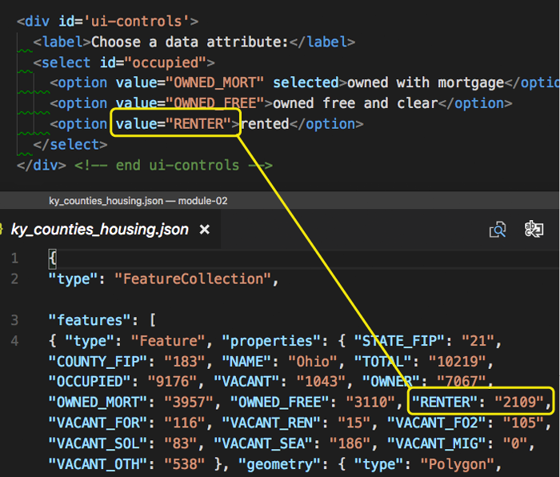  
*Visually connecting the values of the select options to property values in the GeoJSON data file.*

When the user selects the option called "rented", our JavaScript code can get the value of `RENTER` from the option's `value` attribute and use it to update the map.

You'll also notice that we've included the `selected` property on the first option in the HTML, which is a Boolean value indicating that this option is initially selected. This is the text that the user will see in the dropdown menu when the page loads.

We've also added an HTML element to our user interface controls at this point: a `<label>` element, which will help guide the user's actions.

If we save our file now we can see the form element added to the document but positioned outside of the Bootstrap container at the bottom of the page:

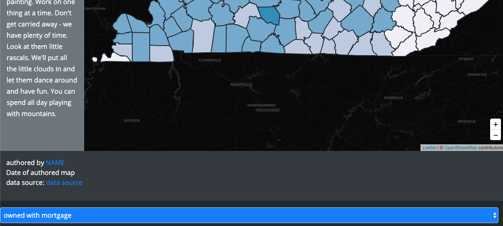  
*An unstyled form element added to the HTML document.*

The form dropdown currently changes the selection within the dropdown, but changing the selection doesn't do anything yet. We need to write code to listen for that change and execute further statements.

Let's now select the UI controls for our dropdown and remove it from the normal display order within the DOM, dynamically placing it within a Leaflet-generated div element on the map itself.

#### Using the Leaflet L.Control class to add UI elements to the map

Leaflet.js provides a method for selecting existing DOM elements, such the div element we just created and gave an `id` attribute of `ui-controls`:

```javascript
L.DomUtil.get("dropdown-ui");
```

Similar to adding the legend, create a Leaflet control object, position it in the top-right corner of the map, and return the DOM element with the `dropdown-ui` id. Toward the bottom of the script, after the `addLegend()` function (and **outside of another function's body curly braces, e.g., `{ ... }`)**, write a new function named `addUi()`.

```javascript
function addUi() {
  // create the slider control
  var selectControl = L.control({ position: "topright" });

  // when control is added
  selectControl.onAdd = function() {
    // get the element with id attribute of ui-controls
    return L.DomUtil.get("dropdown-ui");
  };
  // add the control to the map
  selectControl.addTo(map);
}
```

Now add the `addUi()` function call to the script, writing this at the bottom of the `drawMap()` function (but within that function's body):

```javascript
addUi(); // add the UI controls
```

We should now see our dropdown HTML element added to the top right corner of the Leaflet map.

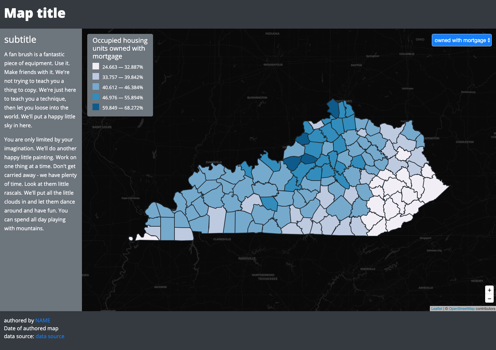  
*The dropdown UI element added to the Leaflet map.*

Of course, changing the dropdown select option doesn't do anything yet. Let's now move on to get our UI functionality working within the JavaScript and dynamically add it to our map. 

## Adding functional interaction to the interface

We need to call the `updateMap()` function each time the user selects a new attribute form the dropdown menu. We wrote the UI element in HTML. Now we need to connect changes in that dropdown selection to the JavaScript itself.

Update the code within the `addUI()` function to:

1. select our `#dropdown-ui` div
2. add an event listener for when the user changes the selection, and
3. call the `updateMap()` function to redraw the map

The first step is to determine which option the user has selected when the dropdown is changed. Above, we briefly introduced JQuery's powerful capabilities to select DOM elements. Here again, we'll begin by selecting the form element itself with the code `$('#dropdown-ui select')`. This targets the `<select>` element inside the element with id `#dropdown-ui`.

Once we have the form selected, we can then use the JQuery method `change()`, which in technical terms binds an "event handler" to a JavaScript change event. This method then "listens" for when the user changes this select form (the "event"). Read the docs for JQuery's change method here: [http://api.jquery.com/change/](http://api.jquery.com/change/).

First, write the code for selecting the element and implementing the JQuery `change()` method. Also, issue a `console.log()` message to test and verify that it's selecting our form element and detecting the user interaction.

```javascript
$('#dropdown-ui select').change(function() {
  // code executed here when change event occurs
  console.log(`Something changed at ${Date.now()}`);
});
```

Within the log statement we can include the time of the event, expressed in the number of milliseconds elapsed since January 1, 1970, 00:00:00 UTC using JavaScript's [Date prototype](https://developer.mozilla.org/en-US/docs/Web/JavaScript/Reference/Global_Objects/Date).

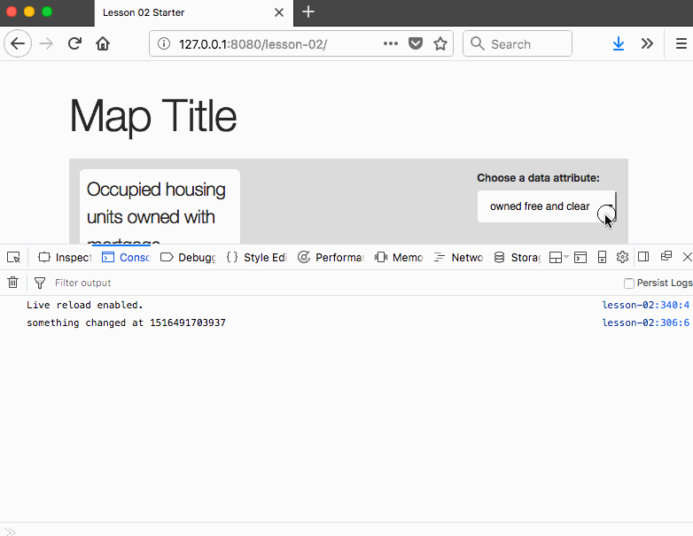  
*The select form text message logged to the Console.*

The code within the callback function is executed every time a change occurs on the select form. Our next objective is to determine which of the options the user has selected. Notice that if we `console.log(this)` the mystifying word `this`, it refers to the "context" of the event, i.e., the select form element itself:

```javascript
$('#dropdown-ui select').change(function() {
  console.log(this);
});
```

The following GIF animation shows the entire select element being logged to console each time it is changed, and we log `this` to Console. Within the output, we also see we have access to the options within the select element.

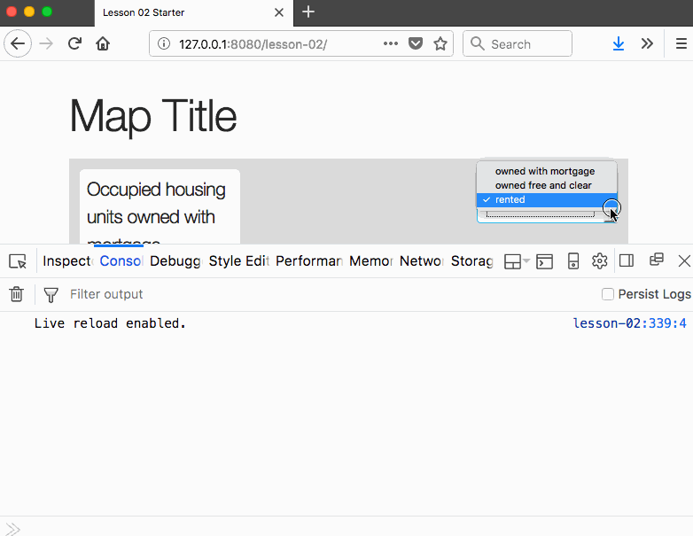  
*The select form ('this') logged to the Console.*

That's neat, but not immediately useful. We need to know which option has been selected by the user. The browser, by default, will change the selected attribute to true for an option that has been selected within the select form, and to false for a previously selected option. So how then can we determine which is selected?

To do this, we can access the `value` property from `this`, and will test with a `console.log()` statement to verify:

```javascript
$('#dropdown-ui select').change(function() {
  console.log(this.value);
});
```

Changing the form selection multiple times verifies that we're able to access the attributes values of our selected options:

  
*The select option value logged to the Console.*

Great! What do we now do with this information? Recall how at the beginning of our script we declared a global variable named `attributeValue` and first hard coded a value of `OWNED_MORT` to it? Because this variable is global, we can now simply reassign it the value the user has selected! So:

```javascript
$('#dropdown-ui select').change(function() {
  attributeValue = this.value;
});
```

Within our script we now have access to which option the user has selected, which we've written to match the data attribute names within the GeoJSON data file. Now let's update that map!

### Applying the user-selected value to the map

Now that we've reassigned the value of our global variable `attribute` to the currently selected option, we want to redraw the map using this attribute. Thankfully, we wrote our initial code to draw the map in a very flexible manner, so this won't be very difficult at all!

Recall how in the callback function of our `drawMap()` method, we first drew our Kentucky county geometries, and then we called another function, `updateMap()` which first calculated the classification break ranges, looped through all the layers (a.k.a. counties), and assigned them a color value based upon the global variable `attributeValue`? What happens now, once we've reassigned the value of `attributeValue` to a new value, if we again call that `updateMap()` function?

```javascript
$('#dropdown-ui select').change(function() {
  // store reference to currently selected value
  attributeValue = this.value;

  // call updateMap function
  updateMap();
});
```

Writing and saving this code, however, doesn't update the map as expected. In fact, it throws an error. Why? We need to revisit where they are called and what arguments are being passed to them.

Remember that the `updateMap()` function definition requires one parameter. We created the `counties` variable within the `drawMap()` function and scoped it to that function, passing it as an argument when we first called `updateMap()` (e.g., `updateMap(counties)`). We'll want access to `counties` within the `addUI()` function as well. So we need to update the function call from `addUI()` and the `addUI()`function definition to reflect this:

  
*The variable `dataLayer` being passed as an arguments among functions.*

The result is successful user interaction! We've connected the user interface to our code. Changing the selection multiple times now loops through our `counties` layers and reassigns a color based upon the user-selected data attribute value.

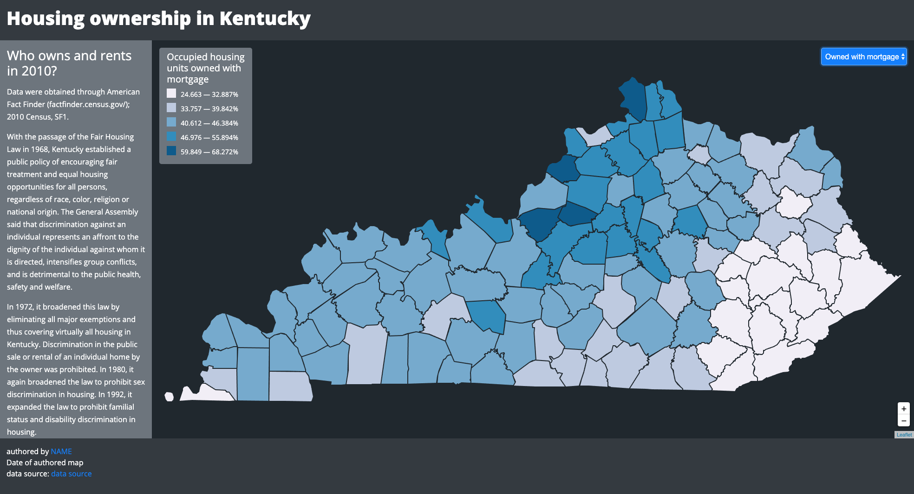  
*Redrawing the map based upon user input.*

Congratulations! You've just built a sophisticated, custom UI element allowing the user to reexpress that mapped features with a different dataset.

## Lesson Task

Currently, the legend is also created anew with each selection change:

1. selected and added to the map using Leaflet's `L.DomUtil()` and `L.Control()` classes, and
1. updated with a new legend title and classification ranges using the updated `breaks` values

While this solution works well on the user end with no noticeable performance hits, there is some redundancy in the code. We're effectively selecting the legend with each dropdown selection and re-adding it to the map before updating the legend title and class range values.

We can update the code responsible for 1.) adding the legend and 2.) updating the legend in a similar way as we are currently 1.) adding the geometries to the map and 2.) updating the fill colors of the features using a separate function.

**Task:** Rewrite the legend code so that the `addLegend()` function only adds the HTML legend to the map and a new function named `updateLegend()` updates the title and class range values when the user selects a new data attribute. (**4 pts**)

### Deliverable

Commit all changes to the completed map from the lesson (_lesson-02/index.html_) and push up to the repository when submitting Assignment #2.

## Resources

- [Leaflet Layer Control](http://leafletjs.com/examples/layers-control/)
- [HTML forms](https://developer.mozilla.org/en-US/docs/Web/Guide/HTML/Forms) and [HTML form elements](http://www.w3schools.com/html/html_form_elements.asp)
- [HTML select element](https://developer.mozilla.org/en-US/docs/Web/HTML/Element/select)
- [Leaflet's map panes' z-indexes](http://leafletjs.com/reference-1.3.0.html#map-mappane)
- [L.Control](http://leafletjs.com/reference-1.3.0.html#control)
- [JQuery's change method](http://api.jquery.com/change/)
